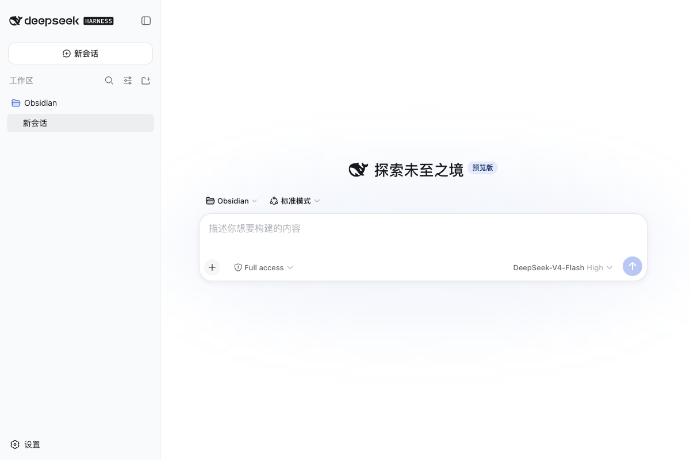
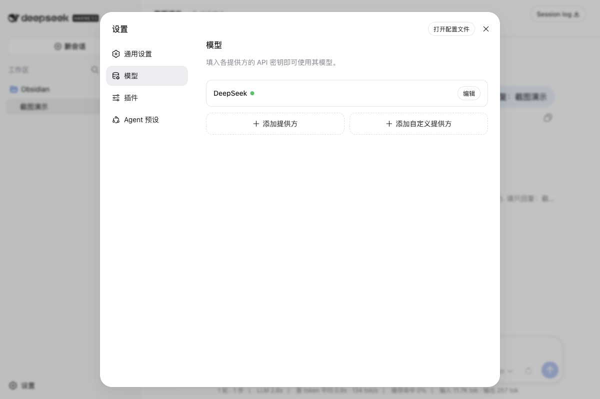
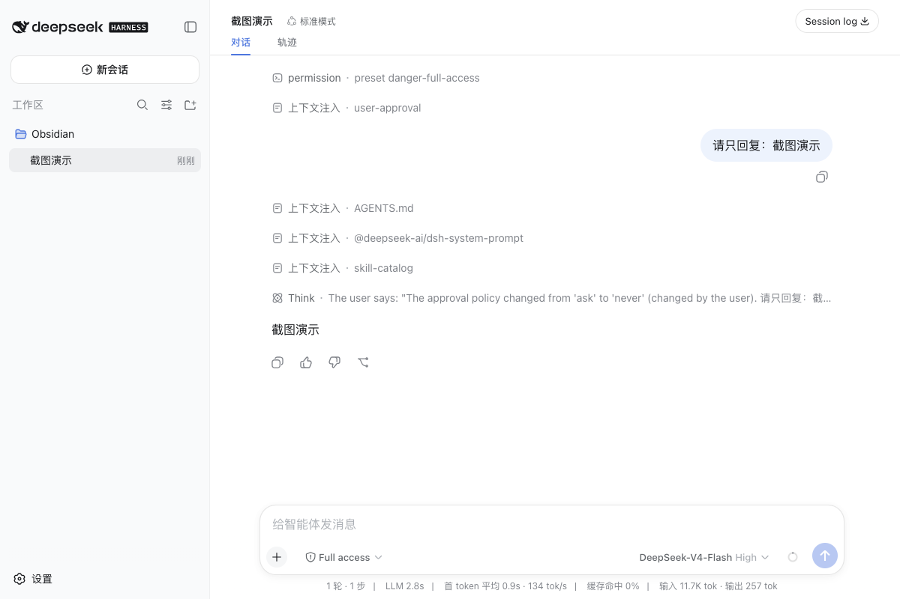

# DeepSeek Desktop

中文版 | [English](README.md)

> 面向 DeepSeek Harness 的非官方桌面发行版，由 DSH Stack 提供底层能力。
>
> **非官方社区项目，与 DeepSeek 无关联。**

DeepSeek Desktop 是面向用户的 macOS 发行版。**DSH Stack** 是其底层的 reproducibility / verification / distribution layer；核心 CLI 和 package 名称继续使用 `dsh-stack` / `@dsh-stack/*`。

DSH Stack 不重新实现 Harness 运行时、插件系统、pnpm、依赖解析、Agent Loop 或官方 Web UI；它负责冻结、验证、重建并打包官方 Harness 环境。

## 下载

打开[当前公开的 Reference / RC Release](https://github.com/xiangyingchang/deepseek-desktop/releases/tag/v0.2.0-rc.8)，根据你的 Mac 选择对应 DMG：

| Mac 类型 | 下载 | 芯片架构 | 当前验证状态 |
|---|---|---|---|
| Intel Mac | [DeepSeek-Desktop-Unofficial-macos-Intel-x86_64.dmg](https://github.com/xiangyingchang/deepseek-desktop/releases/download/v0.2.0-rc.8/DeepSeek-Desktop-Unofficial-macos-Intel-x86_64.dmg) | x86_64 | 原生 Freeze → Verify → Package 和 App 健康检查：PASS；Live Agent 和非开发者 UAT：待验证 |
| Apple Silicon Mac | [DeepSeek-Desktop-Unofficial-macos-Apple-Silicon-arm64.dmg](https://github.com/xiangyingchang/deepseek-desktop/releases/download/v0.2.0-rc.8/DeepSeek-Desktop-Unofficial-macos-Apple-Silicon-arm64.dmg) | arm64 | 原生 Freeze → Verify → Package 和 DMG/App 完整性：PASS；实机 App 和 Live Agent UAT：待验证 |

Release 页面同时提供对应的 SHA-256 文件、verification receipt 和 package-size report。公开资产名称会明确包含 `Intel` 或 `Apple-Silicon`。

当前版本是 **Reference / RC 预发布版**，不是 Stable。公开 App 目前是 ad-hoc 签名且未公证，第一次打开时 macOS 可能显示安全提示。

## 安装和使用

普通用户不需要安装 Node、pnpm、`dsh-stack` CLI，也不需要预先安装 Profile 或打开 Terminal。

1. 下载与你的 Mac 匹配的 DMG。
2. 打开 DMG，把 App 拖到 `Applications` 文件夹。
3. 双击 App。如果 macOS 显示安全提示，按住 Control 点击 App，选择**打开**并确认。
4. 进入官方 Harness 的 **Models** 设置页面。
5. 编辑 **DeepSeek** 提供方，输入 API Key 并保存。支持 `⌘V` / **Edit → Paste** 粘贴。
6. 创建一个 Web session，发送一条消息。
7. 如果 Key 不正确，回到同一个 Models 页面替换并保存，然后重试，不需要重启 App。

升级 RC 时，使用 **DeepSeek Desktop → Check for Updates…**。下载并打开 DMG 后，选择 **Install Update…**，再选择新下载的 `.app`；事务开始前会先停止当前 Runtime。如果候选 App 验证失败，旧 App 和 User State 会保留。公开 v10 App 还没有这个菜单，因此需要先安装一次包含本次修复的新构建。带 `--update-manifest-url` 打包的 App 会检查[发布更新源 Runbook](docs/release-update-feed.md)中描述的常青更新源；没有该参数的 App 会显示手动下载指引。

API Key 由官方 Harness 凭据提供方保存。DSH Stack 不会打印或把 Key 写进 App。

## App 截图

以下截图来自真实的 `DeepSeek Desktop (Unofficial)` App 界面，只包含 App 内容，不包含桌面、菜单栏、浏览器界面或其他应用。

<p align="center">
  
  
  
</p>

## 定制、升级和分享

DeepSeek Desktop 将两类状态分开：

```text
Base Distribution（不可变）
+ 你的 Profile 修改 / 标准 DSH Bundle
= Derived Working Profile
```

通过官方 Harness 安装标准 Bundle 后，就会形成 Derived Working Profile。之后 DeepSeek Desktop 更新必须把这个 Profile Rebase 到新 Base，不能直接替换整个 Profile，更不能静默删除你的 Bundle。DSH Stack 会先验证候选环境，再原子切换；如果变化无法确定合并，升级会被阻止，原来可用的 Profile 保留不动。

App 本体更新是另一条受事务保护的流程。稳定的 Distribution Storage Identity 会把官方 Harness 的凭证、会话、历史记录、偏好、工作区数据和 Derived Profile 保存在不可变 App 包之外。新 App/Base 必须先下载到 staging 并完成验证，之后才能切换；冲突、验证失败、进程中断或新 App 首次启动失败时，旧 App 和 User State 必须继续可用。当前 x86_64 本机旧 App → 新 App 事务链已用隔离环境验证。当前 RC 提供检查/下载和明确的 **Install Update…** 事务入口；可信公开自动安装仍等待 Developer ID 签名、notarization、公开资产/下载校验和独立 clean-machine 回滚验证完成。

维护者必须在同一条 Distribution 的每个版本中保持 `distribution.yaml` 的 `storageId` 不变。公开 Reference Release 继续使用旧版本的 `dsh-web-5590c2a0cb00b3a7`；擅自改变它会产生一个空的用户数据目录。

普通用户分享配置的默认方式是无状态的 `.dshstack`，而不是再次生成一个完整 App：

```text
Share This Setup → Preflight → Secret Scan → Freeze → Verify → Pack
```

产物包含精确的 Profile 定义、Bundle 图、依赖版本、Integrity 和 Receipt；排除 API Key、Credentials、Sessions、Prompt、Response、个人文件、缓存和含有 Secret 的日志。接收方导入后仍走标准 Verify → Materialize → Run，并使用自己的用户数据。完整 `.app/.dmg` 仍是高级分享方式。

这套生命周期不新增 Marketplace、Registry、评分系统、共享运行时或第二份 Plugin Manifest。Harness Profile-owned 文件仍然是唯一 Composition Source of Truth。

## 我应该下载哪个文件？

在 Mac 上打开**苹果菜单 → 关于本机**：

- 如果显示 **处理器：Intel**，下载 x64 DMG。
- 如果显示 **芯片：Apple M1/M2/M3/M4……**，下载 arm64 DMG。

除非你是开发者，否则不要下载 source ZIP；普通用户的安装入口是 DMG。

## 当前状态

| 项目 | 状态 |
|---|---|
| x86_64 Freeze → Verify → Package → DMG | PASS |
| x86_64 App 启动和官方 Harness UI | PASS |
| x86_64 真实 Agent Session 和重启 | PASS |
| x86_64 非开发者 UAT | 当前 Reference 产物 PASS |
| arm64 原生 Freeze → Verify → Package → DMG | CI PASS |
| arm64 App 启动、Live Agent、非开发者 UAT | 等待 Apple Silicon 实机验证 |
| Developer ID 签名、Hardened Runtime、公证、Stapling | 等待 Apple 外部凭据 |
| Stable `v0.1.0` | 尚未发布 |

### Phase 2 生命周期证据

| 项目 | 状态 |
|---|---|
| 官方 Base Freeze → Runtime Verify | 2026-08-16 PASS（`0.1.0-rc.5`，commit `47f9438`） |
| Maintainer Promote → Candidate Verify | 官方 Web Profile PASS |
| `.dshstack` Pack → Import → Runtime Verify | 官方 Web Profile PASS |
| 三方 Rebase、冲突阻断、原子切换 | 自动化回归测试和隔离 App runtime E2E PASS |
| 用户 Bundle 添加后经 Rebase 保留 | 通用 Fixture PASS；真实第三方安装仍受上游 Harness 源码安装问题阻塞 |
| 完整外部 clean-machine 生命周期 UAT | Pending |

## 开发者使用

克隆已重命名的仓库，安装依赖并运行自动化检查：

```sh
git clone https://github.com/xiangyingchang/deepseek-desktop.git
cd deepseek-desktop
pnpm install
pnpm typecheck
pnpm test
```

标准 Pipeline：

```text
Official Harness Profile
        ↓
      Freeze
        ↓
 Verify / Prove
        ↓
    Reproduce
        ↓
      Package
        ↓
 Reference Client
```

查看 Profile，但不修改它：

```sh
pnpm dsh-stack inspect --profile web --harness ../deepseek-harness
```

冻结并验证 Profile：

```sh
pnpm dsh-stack freeze --profile web --harness ../deepseek-harness --output examples/reference
pnpm dsh-stack verify examples/reference --harness ../deepseek-harness
```

通过官方 Web UI 运行已验证的制品：

```sh
pnpm dsh-stack run examples/reference --clean --harness ../deepseek-harness
```

把 Runtime-PASS Stack 打包成 macOS App：

```sh
pnpm dsh-stack package examples/reference --harness ../deepseek-harness --size-report
```

Phase 2 生命周期命令：

```sh
# 检测用户 Profile 漂移，不修改任何一方
pnpm dsh-stack drift <old-base-profile> <current-profile> --json

# 生成三方 Rebase 候选；冲突返回 UPDATE_REBASE_CONFLICT
pnpm dsh-stack rebase <old-base-profile> <current-profile> <new-base-profile> \
  --output ./artifacts/rebase-candidate-profile --report ./artifacts/rebase-report.json

# 将已 Verify 的 Working Profile 手工 Promote 为新的 Candidate
pnpm dsh-stack promote <derived-stack> --harness ../deepseek-harness --output ./artifacts/base-candidate \
  --distribution-version 0.2.0-rc

# 默认分享/导入无状态 Stack
pnpm dsh-stack pack <derived-stack> --harness ../deepseek-harness --output ./setup.dshstack
pnpm dsh-stack import ./setup.dshstack --output ./artifacts/imported
pnpm dsh-stack verify ./artifacts/imported --harness ../deepseek-harness

# 用明确的 Harness checkout 验证升级候选
pnpm dsh-stack upgrade-verify <current-stack> ../deepseek-harness --json

# 检查官方 Harness 源码，不修改当前 checkout
pnpm dsh-stack harness-check ../deepseek-harness --remote origin --ref master --json

# 验证候选后，显式同步干净的源码 checkout
pnpm dsh-stack harness-update <current-stack> ../deepseek-harness \
  --remote origin --ref master --apply --report ./artifacts/harness-update.json
```

`promote`、`pack` 和 `package` 会在操作内部执行真实 Runtime Verify，不信任被编辑或过期的 `verification.receipt.json`。`update` 会 Rebase，保留已验证的物化依赖闭包，然后才切换 `--active <profile-directory>`；验证前不会覆盖当前 Profile。

终端 Harness 更新分两阶段：`harness-check` 不修改当前工作分支；`harness-update --apply` 会先在临时 worktree 中安装官方依赖并执行 Upgrade Verify，只有 PASS 后才快进干净的源码 checkout。详见[Harness 源码更新](docs/harness-update.md)。

每个 App 只包含该 Stack 所需的精确 Harness 和 Profile 闭包，不包含其他 Profile、插件或共享运行时仓库。

## 文档

- [PRD](PRD.md) —— 产品 Contract 和验收标准
- [实施计划](IMPLEMENTATION_PLAN.md) —— Milestone 历史和工程决策
- [Reference Distribution UAT](docs/reference-distribution-uat.md) —— 手工安装和用户测试
- [Phase 2 Generalization](docs/phase-2-generalization.md) —— 外部 Profile 兼容性研究
- [Phase 2 Lifecycle](docs/phase-2-lifecycle.md) —— Base/Derived/Rebase/Share 模型和证据边界
- [Update Manifest 示例](docs/update-manifest.example.json) —— 按架构发布更新检查元数据的格式
- [发布更新源 Runbook](docs/release-update-feed.md) —— 发布带版本的 App 并维护常青 Update Manifest 更新源
- [Harness 源码更新](docs/harness-update.md) —— 在终端检查并安全同步官方 Harness checkout
- [Phase 2 Review](PHASE_2_REVIEW.md) —— PASS / FAIL / UNSUPPORTED 结论

## 安全边界

验证和打包会执行 Harness 与插件代码。一次性运行时目录提供的是可复现性隔离，不是安全沙箱或恶意代码隔离边界。API Key 始终由官方 Harness 凭据提供方管理。
